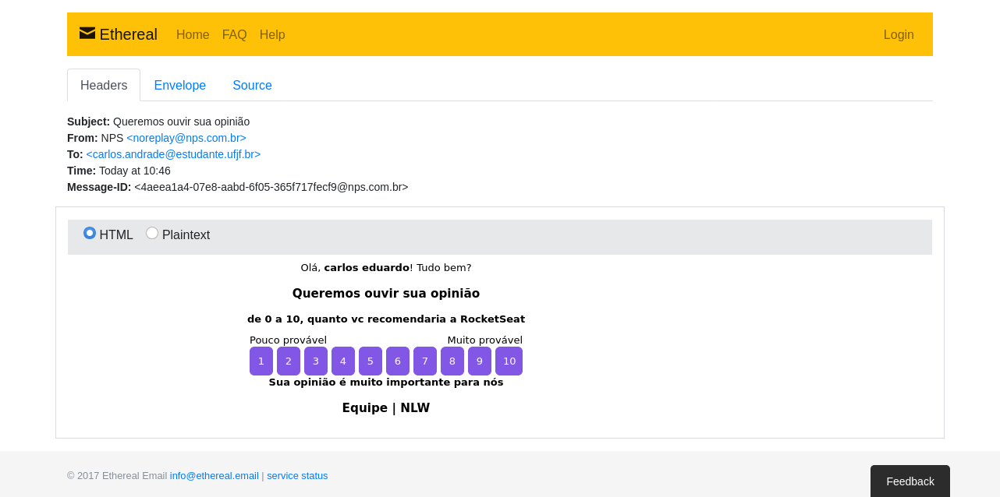

# NPS (Net Promoter Score)



## 🔖 Sobre
NPS ou Net Promoter Score, é uma métrica criada para medir a satisfação dos clientes, geralmente perguntando “de 0 a 10, o quanto você indicaria nossos serviços?”.

## 🛠 Tecnologias

Esse projeto foi desenvolvido com as seguintes tecnologias:

- [Typescript](typescriptlang.org/)
- [NodeJS](https://nodejs.org/)
- [Express](https://expressjs.com/pt-br/)
- [TypeORM](https://typeorm.io#/)
- [SQLite](https://www.sqlite.org/index.html)
- [Handlebars](https://handlebarsjs.com)
- [Nodemailer](https://nodemailer.com/about)
- [Jest](https://jestjs.io/docs/getting-started)
- [Yup](https://github.com/jquense/yup)


## 🗂 Como baixar e iniciar o projeto

```bash
# Abra um terminal e copie este repositório com o comando
$ git clone https://github.com/carlos-mattos/nps.git
# ou use a opção de download.

# Entre na pasta server 
$ cd server

# Instale as dependências
$ npm install

# Rode o servidor
$ npm run dev
```

Desenvolvido por [Carlos Eduardo](https://www.linkedin.com/in/carlos-eduardo-andrade-de-mattos-a060b1182/) 🤓
